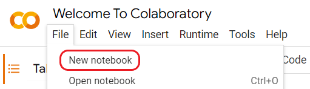
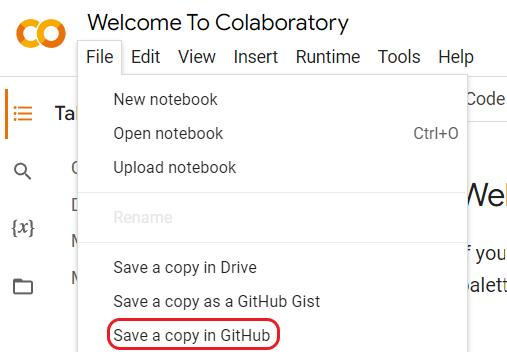

# Colabatory

## Загрузка `.ipynb` на `github`

- Создать файл с расширением `.ipynb` на сайте [Colabatory](https://colab.research.google.com/)
  - File -> New notebook

<picture>
  <source media="(prefers-color-scheme: dark)" srcset="images/colab_new_notebook_dark.png">
  
</picture>

- Создать копию блокнота на `github`
  - File -> Save a copy in GitHub

<picture>
  <source media="(prefers-color-scheme: dark)" srcset="images/colab_save_in_github_dark.png">
  
</picture>

## Ссылки

1. [Вернуться на главную страницу](../README.md)
