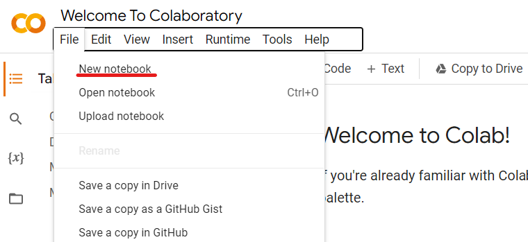
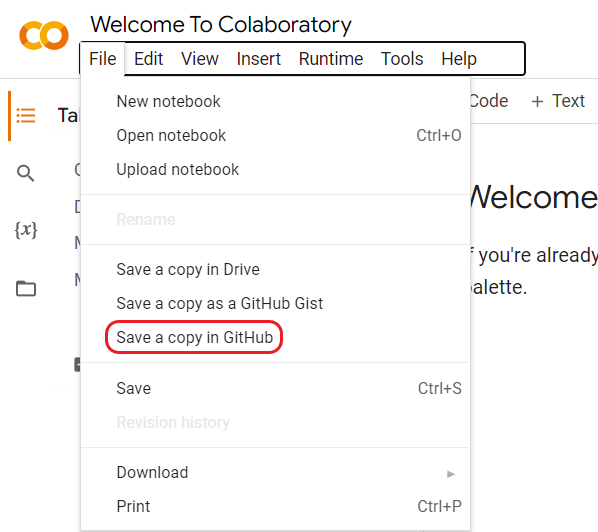

# Colabatory

## Загрузка `.ipynb` на `github`

- Создать файл с расширением `.ipynb` на сайте [Colabatory](https://colab.research.google.com/)
  - File -> New notebook

- Создать копию блокнота на `github`
  - File -> Save a copy in GitHub

## Ссылки

1. [Вернуться на главную страницу](../README.md)
